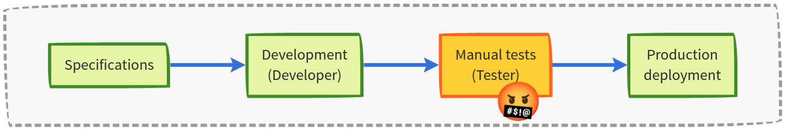
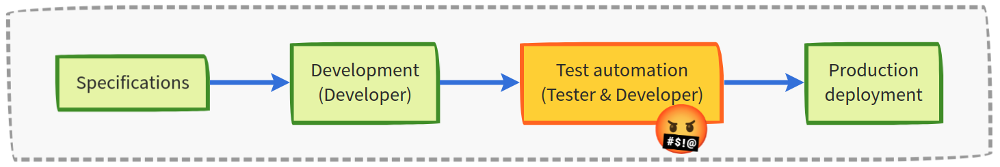
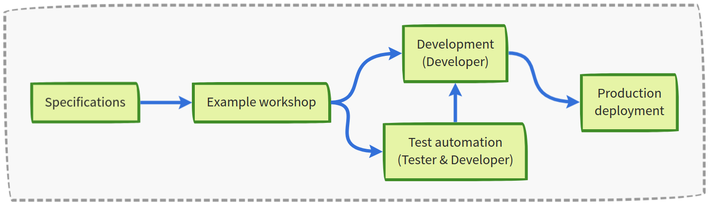
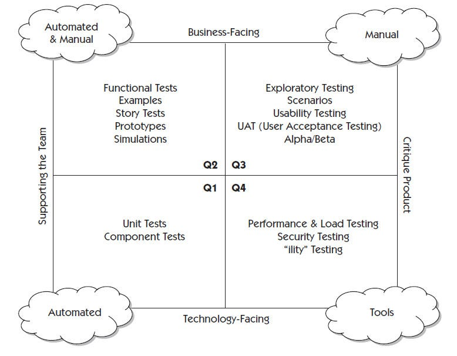

<!-- .slide: class="slide--presentation-title" -->

<br>

<h1 class="mt-3">End to End tests <br>with Cypress</h1>

<br>
<br>

<p class="text-center"><small>Training course by Sébastien Boursault</small>

Notes:

Presentation examples : https://github.com/dzello/revealjs-themes
https://revealjs-themes.dzello.com/robot-lung.html#/
https://revealjs-themes.dzello.com/sunblind.html#/


---


<!-- .slide: id="intro" class="slide--part-title slide--vcenter" -->

<div class="flex-row">
  <div class="part-title">
    <h1>Intro</h1>
  </div>
</div>

---


## About me

<p class="text-size-heading-3"><b>Sébastien Boursault</b>

<ul class="mt-1 no-bullets text-level-1">
  <li>Developer (Java, Python, Js) and Tester
  <li>With an experience as PO
  <li>Trainer (E2E testing)
  <li>What do you expect from this course?
  <li>Is there anything specific you want to talk about?
</ul>

sboursault@proton.me

---

## Tell us a little about yourself

<ul class="mt-2 text-level-1">
  <li>Who are you?
  <li>What technologies (languages, tool, etc.) do you use?
  <li>What projects are you currently working on?
  <li>What is your experience with E2E testing?
  <li>What do you expect from this course?
  <li>Is there anything specific you want to talk about?
</ul>

---

Intent of this course

- understanding good practices to include E2E tests in your development process
- practice with cypress api and tools
- be at ease to search more info on the cypress website
- understand practices to write more maintanable, performant and stable tests

---

<!-- .slide: id="toc" class="slide--vcenter" -->

<div>

## Table of content

<ol class="presentation-toc block">
  <li><a href="#/e2e-tests-dev-process">End to end tests in the <br> development process</a>
  <li><a href="#/good-tests">Qualities of good E2E tests</a>
  <li><a href="#/cypress-tips">Cypress tips</a>
  <li><a href="#/test-strategy">Test strategy</a>
</ol>

</div>

---

## &lt;/> Create a Cypress project

<div class="block--exercice text-level-3">
  <p>Let's code
  <ul>
    <li>Create a github project
    <li>Install and configure cypress to run typescript test
    <li>Create a simplistic test:
      <ul>
        <li><i>The home page title contains "All products"</i>
      </ul>
  </ul>
  <p>What's new
  <ul>
    <li>cypress api (describe, it)
  </ul>
  <p>Userful links
  <ul style="font-size:75%">
    <li class="url-link">https://docs.cypress.io/guides/getting-started/installing-cypress
    <li class="url-link">https://docs.cypress.io/guides/getting-started/opening-the-app
    <li class="url-link">https://docs.cypress.io/guides/guides/command-line
  </ul>
</div>

---


<!-- .slide: id="e2e-tests-dev-process" class="slide--part-title slide--vcenter" -->

<div class="flex-row">

  <div class="part-title">
    <span class="text-level-3">Part 1</span>
    <h1 class="text-size-heading-2">End to end tests in the devevelopment process</h1>
  </div>
  
  <div class="part-toc box fragment"></div>

</div>


---


<h2 class="slide-title" style="font-size: 3vw">What is Behaviour Driven Development?</h2>

<p class="fragment" data-fragment-index="1">When I started on my last project...

<div class="box flex-row apart screen fragment" style="padding:40px;" data-fragment-index="2">
  <div class="badge" data-arrow="->task-dev">Specifications</div>
  <div class="badge fragment" data-arrow="->task-test" id="task-dev" data-fragment-index="3">Development<br>(Developer)</div>
  <div class="badge overlay-anchor fragment" data-arrow="->task-prod" id="task-test" data-fragment-index="4">Manual tests<br>(Tester)
    <div class="overlay overlay--friction fragment">
      <i class="emo emo-64 emoji-face_with_symbols_on_mouth"></i>
    </div>
  </div>
  <div class="badge fragment" id="task-prod" data-fragment-index="5">Production <br> deployment</div>
</div>

<p class="print"></img></p>

<div class="flex-row">
  <div class="flex-column tiny-gap">
    <ul class="mt-2 text-level-4 no-bullets">
      <li class="fragment"><i class="emo emoji-x"></i>Different understanding
      <li class="fragment"><i class="emo emoji-x"></i>Regressions happen
      <li class="fragment"><i class="emo emoji-x"></i>Too many non regression tests to execute manually
    </ul>
    <div class="sticky fragment">
      Not very satisfying &nbsp; :(
    </div>
  </div>
  <div class="bubble bubble-bottom-left flex-row fragment">
    <i class="emo emo-36 emoji-nerd_face"></i>
    <span class="bubble__text">Maybe we should automize <br> end to end tests...</span>
  </div>
</div>
    


---

<p class="fragment " data-fragment-index="1">So, let's automize end to end tests...

<div class="box flex-row apart screen fragment" style="padding:40px;" data-fragment-index="2">
  <div class="badge" data-arrow="->task-dev">Specifications</div>
  <div class="badge fragment" id="task-dev" data-arrow="->task-test" data-fragment-index="3">Development<br>(Developer)</div>
  <div class="badge overlay-anchor fragment" id="task-test" data-arrow="->task-prod" data-fragment-index="4">Test automation<br>(Tester & Developer)
    <div class="overlay overlay--friction fragment">
      <i class="emo emo-64 emoji-face_with_symbols_on_mouth"></i>
    </div>
  </div>
  <div class="badge fragment" id="task-prod" data-fragment-index="5">Production <br> deployment</div>
</div>

</img>

<div class="mt-3 flex-row">
  <div class="flex-column gap-10">
    <ul class="text-level-4 no-bullets">
      <li class="fragment"><i class="emo emoji-x"></i>Different understanding
      <li class="fragment"><i class="emo emoji-thumbup"></i>Fewer regressions
      <li class="fragment"><i class="emo emoji-x"></i>Tests are difficult to write and to maintain <br> (the program wasn't designed with the tests in mind)
    </ul>
    <div class="sticky fragment">
      Better quality, but not efficient... <div class="fragment">and we intruced new difficulties&nbsp; :(</div>
    </div>
  </div>
  <div class="bubble bubble-bottom-left flex-row fragment">
    <i class="emo emo-36 emoji-face_with_monocle"></i>
    <span class="bubble__text">So...<br>What's the solution?</span>
  </div>
</div>


---

<p class="fragment">The <strong>Behaviour Driven Development</strong> approach

<div class="box flex-row screen fragment" style="padding:30px;">
  <div class="badge" data-arrow="->task-example">Specifications</div>
  <div class="badge fragment" id="task-example" data-arrow="->task-dev,->task-test">Example workshop</div>
  <div class="flex-column">
    <div class="badge fragment" id="task-dev" data-arrow="->task-prod">Development<br>(Developer)</div>
    <div class="badge fragment" id="task-test">
      Test automation<br>(Tester & Developer)
      <span class="fragment" data-arrow="task-test->task-dev"></span>
    </div>
  </div>
  <div class="badge fragment" id="task-prod">Production <br> deployment</div>
</div>

</img>

<p class="apart text-level-3 fragment">For each story, we agree on a set of concrete <strong>key examples</strong>

<ul class="text-level-3 no-bullets fragment">
  <li class="fragment"><i class="emo emoji-thumbup"></i>The team discover unknown unknowns earlier
  <li class="fragment"><i class="emo emoji-thumbup"></i>Shared understanding
  <li class="fragment"><i class="emo emoji-thumbup"></i>We get the <strong>Scenarios to automate</strong> out of the process
</ul>


---

## Specification by example

A few words about specification by examples and 3 amigos ?

---

## &lt;/> Define acceptance criteria

<div class="block--exercice mt-5">
  <p>The Product Owner presents a new story:
  <ul>
    <li class="text-level-3"><i> As a shopper,<br>
    I want to see my basket content in the mini-basket,<br>
    so that I always know the basket's content and amount.</i>
  </ul>
  <p class="mt-2">As a team, define acceptance criteria for this story

</div>

Note:

_The trainer takes the role of the Product Owner, the participants are the testers. They must suggest acceptance criteria to the PO._
_The PO can show mockups or wireframes_
_The PO can kindly reject some criterias if he thinks they are not required right now. Example : displaying discounts.


_Possible list:_

- _The mini basket always shows the number of products in basket_
- _It contains basket entries (with prodcut name, quantity and price)_
- _When empty, it doesn't show the number of products in basket_
- _When empty, it informs the basket is empty_


---

## &lt;/> Automize verification with cypress

<div class="block--exercice text-level-3">
  <p>In the last workshop, we identifed some acceptance criteria.
  <p>Let's code
  <ul>
    <li>Automize the verification of these criteria
  </ul>
  <p>Cypress commands that may help
  <ul class="text-level-4">
    <li><code>visit</code>, <code>get</code>, <code>contains</code>, <code>click</code>, <code>should</code>
  </ul>
  <p>Userful links
  <ul style="font-size:75%">
    <li class="url-link">https://docs.cypress.io/api/table-of-contents
    <li class="url-link">https://chromewebstore.google.com/detail/css-and-xpath-checker/aoinfihhckpkkcpholfhmkeplbhddipe
  </ul>
</div>

Note:

_The trainer writes and explains the tests for:_

- _The mini-basket always shows the number of products in basket_
- _When empty, it doesn't show the number of products in basket_

_The spec file can be created from the Cypress dashboard._


---


<!-- .slide: id="improve-maintanability" class="slide--part-title slide--vcenter" -->

<div class="flex-row">

  <div class="part-title">
    <h1>Improve maintanability</h1>
  </div>
  
  <div class="part-toc box fragment"></div>

</div>

Note:


Simplify code with dedicated selectors, custom command and page object

---

## Why investing in maintainability?

<p class="fragment">We spend much more time reading code, than writing it.<br/>
So the code should optimize for reading.

<p class="mt-2 fragment">An E2E test have many reasons to fail
<ul class="fragment">
  <li>the application may not have been designed to be tested
  <li>the UI can change frequently
  <li>asynchronous nature of the browser
</ul>
<p class="fragment">As a result, a SDET can spend more than half of his time on test maintenance.

Note:
SDET: automaticien

---

<h2 class="slide-title">Dedicated selectors</h2>

<p class="mt-5 fragment">Add a<code>data-testid</code> attribute to query your html elements</p>

```html
<input type="email" id="email" name="email"
  class="form-control" data-testid="register-form__email-input"/>
```

<!-- .element: class="fragment mt-3" -->

<p class="mt-5 fragment">Selectors based on a dedicated attribute are <strong>more efficient</strong> and<br> <strong>more robust to changes</strong></p>


Note:

The data-cy attribute will not change from CSS style or JS behavioral changes, meaning it's not coupled to the behavior or styling of an element.
Don't test it if it's not testable


---

<h2 class="slide-title">Custom command</h2>

<p class="fragment">Let's take an example

```typescript
cy.get(`[data-testid=my-component]`)
```
<!-- .element: class="fragment" -->

<div class="fragment mt-2">

<p class="text-level-2">can be simplified with a custom command:

```typescript 
cy.getByTestid(`my-component`)
```

</div>

<p class="fragment mt-3">Custom commands work well for behaviors that are desirable across many tests.


---

## &lt;/> Creating a custom command


<div class="block--exercice text-level-3">
  <p>Let's code
  <ul>
    <li>Create the custom command <code>cy.getByTestid()</code> and refactor the test code to use it.
  </ul>
  <p>Hints
  <ul>
    <li>Define the command in <code>cypress/support/commands.js</code>
  </ul>
  <p>Userful links
  <ul style="font-size:75%">
    <li class="url-link">https://docs.cypress.io/api/cypress-api/custom-commands
    <li class="url-link">https://docs.cypress.io/guides/tooling/typescript-support#Types-for-Custom-Commands
  </ul>
</div>

---

<h2 class="slide-title">Page object pattern</h2>

<p class="mt-4 fragment">Page objects abstract away the technical interactions from the decision code</p>

```typescript
cy.get(".basket-mini .dropdown-toggle").click(); // this is about HTML

```
<!-- .element: class="fragment" -->

```typescript
cataloguePage.displayMiniBasket();               // this is about the
                                                 // application
```

<!-- .element: class="fragment" -->

<p class="mt-3 fragment">Tests with Page Objects are <strong>easier to read</strong> and <strong>easier to maintain</strong>


---

## &lt;/> Test with Page Objects


<div class="block--exercice text-level-3">
  <p>Let's code
  <ul>
    <li>Refactor your tests to use a page object reprensenting the catalog page.
  </ul>
  <p>Hints
  <ul>
    <li>Create the <code>CatalogPage</code> in <nobr><code>cypress/support/page-objects/catalog-page.ts</code></nobr>
    <li>Add the methods
      <ul>
        <li><code>miniBasketLink()</code> to obtain the mini basket link
        <li><code>showMiniBasket()</code>
        <li><code>addProductToBasket(produtId: number)</code>
      </ul>
  </ul>
</div>


---

## Let's practice on the login

Let's have the same exercice to verify the login

---

## &lt;/> Define acceptance criteria

<div class="block--exercice mt-5">
  <p>The Product Owner presents a new story:
  <ul>
    <li class="text-level-3"><i> As a shopper,<br>
    I want to see my basket content in the mini-basket,<br>
    so that I always know the basket's content and amount.</i>
  </ul>
  <p class="mt-2">As a team, define acceptance criteria for this story

</div>

Note:

_The trainer takes the role of the Product Owner, the participants are the testers. They must suggest acceptance criteria to the PO._
_The PO can show mockups or wireframes_
_The PO can kindly reject some criterias if he thinks they are not required right now. Example : displaying discounts.


_Possible list:_

- _The mini basket always shows the number of products in basket_
- _It contains basket entries (with prodcut name, quantity and price)_
- _When empty, it doesn't show the number of products in basket_
- _When empty, it informs the basket is empty_


---

## &lt;/> Automize verification with cypress

<div class="block--exercice text-level-3">
  <p>In the last workshop, we identifed some acceptance criteria.
  <p>Let's code
  <ul>
    <li>Automize the verification of these criteria
  </ul>
  <p>Cypress commands that may help
  <ul class="text-level-4">
    <li><code>visit</code>, <code>get</code>, <code>contains</code>, <code>click</code>, <code>should</code>
  </ul>
  <p>Userful links
  <ul style="font-size:75%">
    <li class="url-link">https://docs.cypress.io/api/table-of-contents
    <li class="url-link">https://chromewebstore.google.com/detail/css-and-xpath-checker/aoinfihhckpkkcpholfhmkeplbhddipe
  </ul>
</div>

Note:

_The trainer writes and explains the tests for:_

- _The mini-basket always shows the number of products in basket_
- _When empty, it doesn't show the number of products in basket_

_The spec file can be created from the Cypress dashboard._


---

<!-- .slide: id="good-tests" class="slide--part-title slide--vcenter" -->

<div class="part-title">
  <span class="text-level-3">Part 2</span>
  <h1>Qualities of good tests</h1>
</div>

---

## Good automated tests are F.I.R.S.T

<div class="mt-5 fragment">

- Fast
- Isolated
- Repeatable
- Small
- Timely

</div>

Note:

Ask the trainee to list the qualities of a good test.
This is the one thing the learner should memorize.


---

<!-- .slide: class="slide--vcenter" -->

<div>
<h3>Fast</h3>

  <p class="fragment">The faster the test suite, the more offten it can run

  <p class="fragment">Shortening the feedback loop accelerates the development process
</div>
<!-- cost of switching subject -->

---

<!-- .slide: class="slide--vcenter" -->

<div>
  <h3>Isolated</h3>

  <p class="fragment">Isolated tests can run in any order

  <h3 class="fragment">Repeatable</h3>

  <p class="fragment">Repeatable tests don't depend on the state of the environment in which they run

  <p class="fragment apart">Without isolation and repeatability, you often get false positive. The biggest risk is too <strong>loose confidence in your tests</strong>.

</div>

Note: move the environment to a <strong>well-known state</strong> before they run

---

<!-- .slide: class="slide--vcenter" -->

<div>
  <h3>Small</h3>

  Avoid automating all UI end-to-end journeys. 

  Write **atomic** scripts so that when they fail, you know why.

</div>


Note:
originaly: Simple and Self-Verifying
- Test must be easy to read
- The purpose of a test should be obvious
- Apply clean code practices (DRY, KISS, Single responsibility, solid ?)

---

<!-- .slide: class="slide--vcenter" -->

<div>
  <h3>Timely</h3>

  <p class="fragment">Try to automate tests before development

  <div class="apart text-level-2">
  <!--When written before development / Benefits -->
  <ul>
    <li class="fragment">Production code is crafted so it's <strong>testable</strong>
    <li class="fragment">Tests are used to <strong>validate the changes</strong>
  </ul>
  </div>

  <p class="apart text-level-2 fragment">Testing before development is more fun,<br> more beneficial, more productive, and less frustrating

</div>


---


<!-- .slide: id="cypress-tips" class="slide--part-title slide--vcenter" -->

<div class="flex-row">

  <div class="part-title">
    <span class="text-level-3">Part 3</span>
    <h1>Cypress tips</h1>
  </div>
  
  <div class="part-toc box fragment"></div>

</div>

---

debugger...

---

<h2 class="slide-title">Wait for events, not time</h2>


<h3 class="fragment">When can I verify the result of async operations?</h3>

```typescript
// bad
cy.wait(2000)  // wait for 2 seconds

// Good
cy.contains('Welcome')  // wait for the page to contain "welcome"

// Good
cy.intercept('POST', '/api/basket/add-product').as('addProductToBasket')
cy.get('button').contains('Add to basket').click()
cy.wait('@addProductToBasket')  // wait for a http response
```

<!-- .element: class="fragment" -->

<p class="text-level-2 apart fragment">Wait for events to avoid <strong>long</strong> and <strong>flaky</strong> tests</p>

<small class="fragment">More on cypress implicit waits: <a href="https://docs.cypress.io/guides/references/best-practices#Unnecessary-Waiting">https://docs.cypress.io/guides/references/best-practices#Unnecessary-Waiting</a></small>

Note:
Testing offten involves asynchronous behaviours.


---

<h2 class="slide-title">Minimize UI interactions</h2>


<p class="mt-5 fragment">Try to <strong>avoid the UI</strong> for all the parts of the tests <br> not dealing with <strong>UI-specific risks</strong>

<p class="mt-2 fragment">Setup your tests through <strong>api</strong>, <strong>db access</strong>...

<p class="mt-5 fragment">No UI set-up is <strong>faster</strong> and <strong>easier to maintain</strong>

Note:

From 50 quick ideas...
By avoiding the UI layer where it is not actually relevant for the purpose of the test, teams can save a lot of troubleshooting time and speed up feedback, while still keeping the same level of risk coverage.

Even when tests need to execute through the UI, minimise the part of the test that actually simulates user actions. Evaluate which parts of the tests are actually dealing with UI-specific risks, and try to automate everything else by avoiding the UI.

Set-up and clean-up tasks serve to make tests reliable and repeatable, but they do not actually deal with the user interface risk (or, more precisely, they should not – if a set-up task is testing things, it should be broken into several tests).

---

<h2 class="slide-title">Never ignore failing tests</h2>

<p class="mt-6 fragment">Fix flaky tests as soon as possible

<p class="fragment">If not fixed within a given time frame,<br> <strong>quarantine</strong> or <strong>delete</strong> the flaky test

<p class="fragment">Don't let flaky tests attack your confidence!


---

<!-- .slide: id="test-strategy" class="slide--part-title slide--vcenter" -->

<div class="flex-row">

  <div class="part-title">
    <span class="text-level-3">Part 4</span>
    <h1>Test strategy</h1>
  </div>
  
  <div class="part-toc box fragment"></div>

</div>

---


<!-- .slide: data-auto-animate -->
<h2 class="slide-title">Agile testing quandrants</h2>



---
<!-- .slide: data-auto-animate -->

<h2 class="slide-title screen">Agile testing quandrants</h2>

<div class="flex-row text-level-3">

  

  <div>
    <div class="">To succeed, you probably need tests from each quadrants!</div>
    <div class="mt-3 fragment">You can't automate everything</div>
    <p class="fragment">So, focus on:</p>
    <ul>
      <li class="fragment">Critical paths (eg. registration)</li>
      <li class="fragment">Risk areas (eg. payment)</li>
      <li class="fragment">Parts that are hard to test manually</li>
    </ul>
  </div>
</div>


Notes:
What type of tests do you know?
  put them on a board as people give them, organized like the quadrant
Which ones are necessary to succeed?
- What is diffcult to test manually should be automated
- What is difficult to automate, could be verified manually
- You can't automate everything
- Automated tests free testers up to focus on more exploratory-type testing

- Risk areas include checkout, payemnts, etc.
- Hard to test manually:
  - complex setup (data, configuration...)
  - tests on multiple device
  - etc.


---

<h2 class="slide-title">3 amigos</h2>


---

<h2 class="slide-title">Who automates the tests?</h2>

<p class="mt-5 fragment">Favour a <strong>whole team approach</strong></p>

<p class="mt-3 text-level-2 fragment">Developers and testers work together to</p>
<ul class="text-level-2">
  <li class="fragment">Build and maintain the test infrastructure</li>
  <li class="fragment">Design testable code</li> <!-- Developers write more testable code -->
  <li class="fragment">Write and maintain the automated tests</li>
</ul>

Notes:
- Build and maintain the test infrastructure -> requires the dev ops help
- Design testable code -> requires developers
- Write and maintain the automated tests -> requires developers
Any task might be completed by any team member
While a team can have automation experts, it doesn't limit particular tasks to particular team members
Everyone should feel responsible for the automated tests
**Without automated tests, we don't have a quality product.**


---

<h2 class="slide-title">Continuous Integration <br> / Continuous Delivery</h2>

<h3 class="mt-4 fragment">Run automated tests on each release</h3>

<p class="text-level-2 fragment">as part of your CI/CD pipeline

<h3 class="fragment">Run E2E tests on a dedicated environment</h3>
<p class="text-level-2 fragment">A shared environment is not predictible
<p class="text-level-2 fragment">This environment is built as part of the CI/CD pipeline

Note:
On a shared environment, tests can fail for external reasons.
you must have clear control over the environment in which the tests run.


