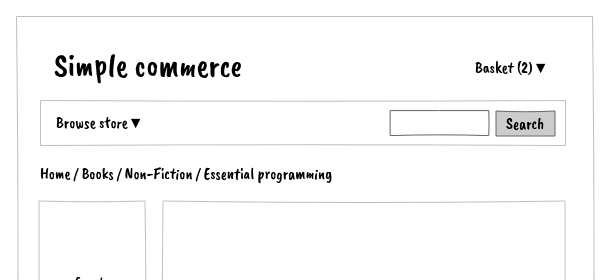
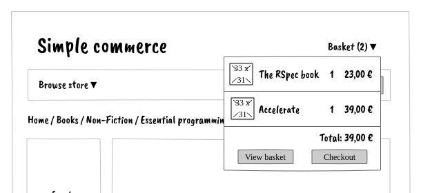

# Mini-basket

As a shopper,

I want to see my basket content in the mini-basket,

so that I always know the basket's content and amount.

## Wireframes

## Acceptance criteria

The **number of products** is always visible (not the number of entries).

- When I have **1** product A and **2** product B, the number of products is **3**

Click on the Basket button shows the mini basket

It diseapears when i click outside the mini-basket

The mini basket shows the entries in the basket : the product name, quantity and price.

`Basket amount = sum of entries ( price * quantity )`

- Given Product A costs **10** and product B costs **15**

  When I have **1** product A and **2** product B

  Then the basket amount is **40**

When empty, the mini basket shows "**Empty**"

----

*There could be much more questions. We can get ideas from the **shaded figs** in annex.*

<u>*Possible questions*</u>:

- *What about delivery fees?*
- *What if there is no product in the basket?*
- *What if there is a discount?*
- *What if there is a voucher?*
- *What if the product is out of stock ? or there's not enough in stock? or it's no more in stock?*
- *What if the product is not sold anymore?*
- *On each entry should I see the product price or the entry amount?*
- *Is there a maximum quantity for each product?*
- *Is there a maximum basket amount?*
- What if the mini-basket is higer than the page?
- When does the mini basket disapear?
