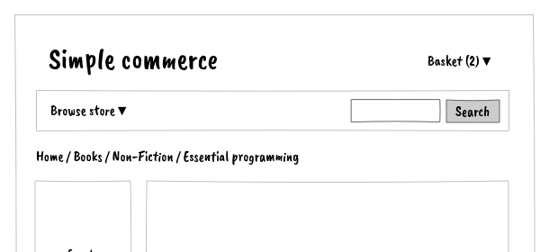
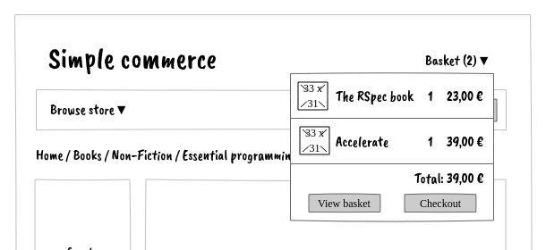

# Mini-basket

As a shopper,

I want to see my basket content in the mini-basket,

so that I always know the basket's content and amount.

## Wireframes

## Acceptance criterias

We can get ideas from the ***shaded figs*** in annex.

Possible questions

- What about delivery fees?
- What if there is no product in the basket?
- What if there is a discount?
- What if there is a voucher?
- What if the product is out of stock ? or there's not enough in stock? or it's no more in stock?
- What if the product is not sold anymore?
- Should I see products and quantities, price per item or per rown?
- Is there a maximum quantity for each product?
- Is there a maximum basket amount?

!!!!!!!! PUT THE EXAMPLES HERE !!!!!!!!!!!!

